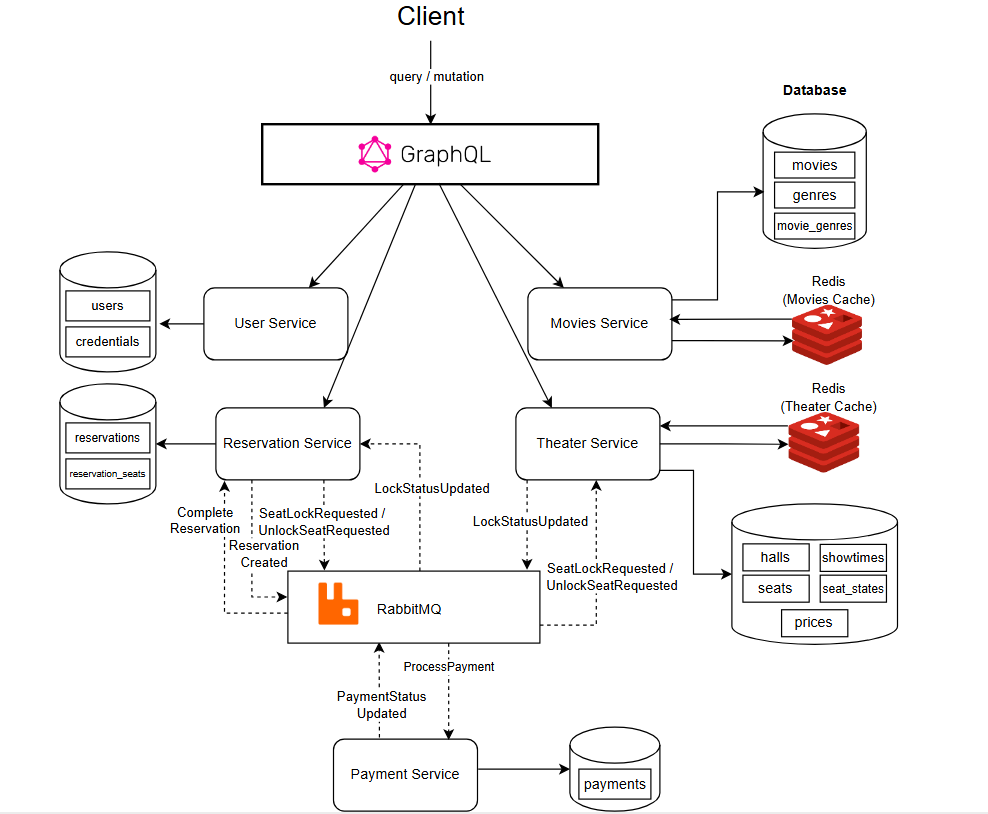
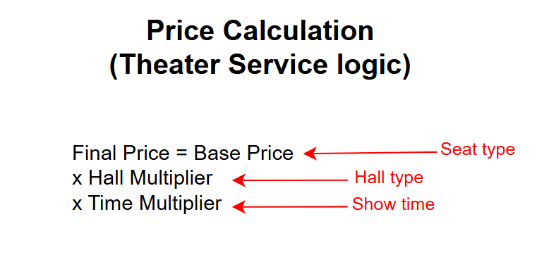

# Moviq
Microservices-based cinema reservation system using GraphQL, Redis caching, and RabbitMQ event-driven communication.

## 🏗 Architecture Overview

The system is designed with service boundaries that isolate concerns, ensuring scalability and fault tolerance.


### Tech Stack
- **Framework:** .NET 9 / ASP.NET Core
- **API Style:** GraphQL (HotChocolate) with Gateway Schema Stitching
- **Databases:** PostgreSQL (Relational Data), Redis (Caching)
- **Message Broker:** RabbitMQ (Asynchronous Event-Driven Communication)
- **Security:** JWT Authentication with Cookie-based Relay
- **Payments:** Stripe Integration (Sync via gRPC / Async via Webhooks)
- **Containerization:** Docker & Docker Compose

---

## 🚀 Key Workflows

### 1. Asynchronous Seat Reservation (Race Condition Prevention)
To ensure data integrity when multiple users attempt to book the same seat simultaneously, we implemented an asynchronous locking mechanism:
1. **Reservation Service** publishes a `SeatLockRequested` event to RabbitMQ.
2. **Theater Service** (the source of truth for seat states) processes the event.
3. If the seat is available, it transitions to a `Locked` state and publishes `SeatLocked`.
4. If unavailable, it publishes `SeatLockFailed`.
5. The **Reservation Service** updates the reservation status based on these events.

*Note: WebSockets were intentionally avoided to focus on backend consistency via the message broker.*

### 2. GraphQL Gateway & Cookie Relay
The **Gateway Service** acts as a unified entry point, stitching schemas from all sub-services. We implemented a custom `SetCookieRelayHandler` and `HttpRequestInterceptor` to ensure that:
- JWTs issued by the **Users Service** are stored in `HttpOnly` cookies.
- These cookies are automatically relayed from the browser through the Gateway to the sub-services for authorization.

### 3. Pricing Engine
The system calculates ticket prices dynamically based on three core dimensions:

---

## 🛠 Service Breakdown

| Service | Responsibility |
| :--- | :--- |
| **Gateway** | Schema stitching, JWT/Cookie relay, and unified endpoint. |
| **Users** | Identity management, OTP Verification, and Authentication. |
| **Movies** | Catalog management (Movies, Genres) with Admin-only mutations. |
| **Theater** | Management of Halls, Showtimes, and Seat states. |
| **Reservation** | Orchestrates the booking flow and seat locking events. |
| **Payment** | Stripe integration and gRPC communication for checkout sessions. |

---

## ⚙️ Setup & Configuration

### Environment Variables (.env)
Create a `.env` file in the root directory with the following variables:

```env
# Database
DB_PASSWORD="your_db_password"

# Stripe 
STRIPE_SECRET_KEY="sk_test_..."
STRIPE_WEBHOOK_SECRET="whsec_..."

# JWT Tokens
JWT_TOKEN_USER="your_long_secure_secret_string"
JWT_TOKEN_RESERVATION="your_long_secure_secret_string"
```
